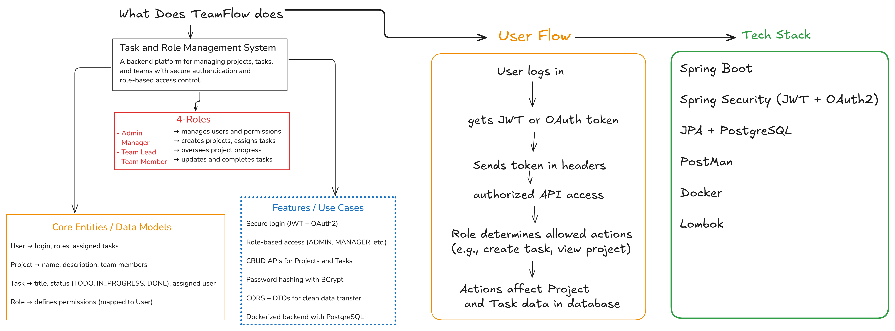
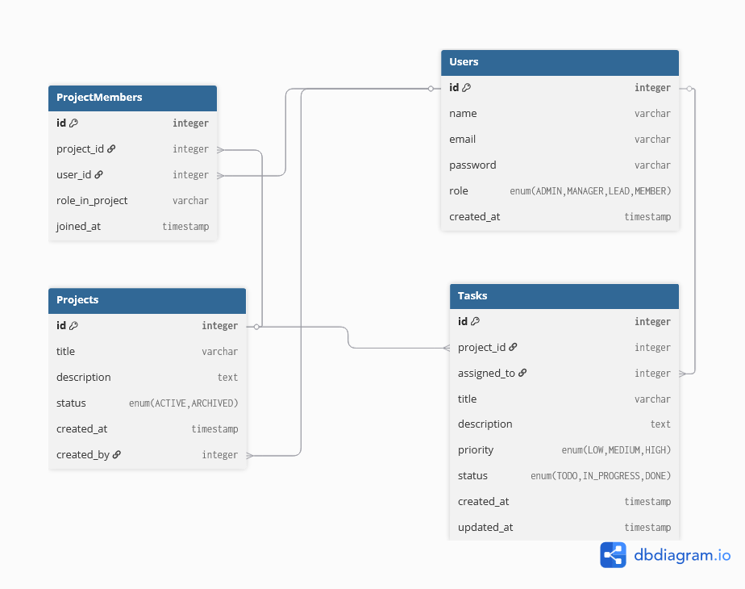

 # 🧭 TeamFlow – Role-Based Task Management System


TeamFlow is a backend-driven task management system built with Spring Boot that demonstrates JWT & OAuth2 authentication, role-based access control, and modular REST API design — a simplified version of Jira built for clarity and backend mastery.

## 🚀 Features

Secure authentication with JWT and OAuth2 (GitHub/Google)

Role-based access: Admin, Manager, Team Lead, Team Member

CRUD APIs for Projects and Tasks

Layered architecture: Controller → Service → Repository → Entity

PostgreSQL database with JPA/Hibernate

Swagger UI for API documentation

Dockerized setup for both backend and database

Configurable via environment variables (.env support)

## 🧩 Tech Stack

Spring Boot | Spring Security | JPA/Hibernate | PostgreSQL | Docker | Lombok | Swagger/OpenAPI

## 🧠 Entities & Relationships


```
Table Users {
  id integer [primary key]
  name varchar
  email varchar [unique]
  password varchar
  role enum('ADMIN', 'MANAGER', 'LEAD', 'MEMBER')
  created_at timestamp
}

Table Projects {
  id integer [primary key]
  title varchar
  description text
  status enum('ACTIVE', 'ARCHIVED')
  created_at timestamp
  created_by integer [ref: > Users.id]
}

Table ProjectMembers {
  id integer [primary key]
  project_id integer [ref: > Projects.id]
  user_id integer [ref: > Users.id]
  role_in_project varchar
  joined_at timestamp
}

Table Tasks {
  id integer [primary key]
  project_id integer [ref: > Projects.id]
  assigned_to integer [ref: > Users.id]
  title varchar
  description text
  priority enum('LOW', 'MEDIUM', 'HIGH')
  status enum('TODO', 'IN_PROGRESS', 'DONE')
  created_at timestamp
  updated_at timestamp
}
```
## Setup

- Clone repository
`git clone https://github.com/yourusername/teamflow.git`

- Build and run using Docker
`docker-compose up --build`
